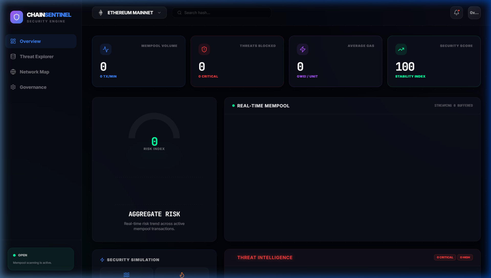

# 🛡️ ChainSentinel | AI-Powered Web3 Security Intelligence

ChainSentinel is a production-grade Web3 security platform designed to monitor the Ethereum mempool in real-time. It utilizes a hybrid detection engine combining deterministic heuristics with Machine Learning (Isolation Forest) to identify and mitigate front-running, sandwich attacks, and gas manipulation in real-time.



## 🚀 Key Features

- **Real-Time Mempool Analysis**: Streams live transactions directly from the peer-to-peer network layer.
- **AI Threat Detection**: Uses Isolation Forest ML models to detect anomalous transaction patterns.
- **Multi-Vector Security**: Specialized detection for Sandwich Attacks, Gas Spikes, and Contract Bursts.
- **Active Defense Relay**: One-click mitigation to protect contracts from identified threats.
- **Premium Dashboard**: Futuristic, data-rich interface built with React, Tailwind v4, and Framer Motion.
- **Responsive Architecture**: Fully optimized for Desktop, Tablet, and Mobile devices.

## 🛠️ Technical Stack

- **Frontend**: React 18, TypeScript, Tailwind CSS v4, Framer Motion, Recharts.
- **Backend**: Node.js, Express, WebSocket (ws), Ethers.js.
- **ML Engine**: Custom Isolation Forest implementation for real-time anomaly scoring.
- **Database**: MongoDB (Mongoose) for persistent alert logging and historical analysis.

## 📦 Installation & Setup

### 1. Prerequisites
- Node.js (v18+)
- MongoDB (Optional, falls back to ephemeral mode)
- An Ethereum RPC Provider (Alchemy/Infura) for Mainnet data.

### 2. Clone and Install
```bash
git clone https://github.com/rajat020-cloud/ChainSentinel.git
cd ChainSentinel
```

### 3. Start Backend
```bash
cd backend
npm install
npm run dev
```

### 4. Start Frontend
```bash
cd frontend
npm install
npm run dev
```

## 👥 Collaboration & Team

This project is built for high-scale collaborative security research. 

---
*Built with ❤️ for a safer Web3.*
